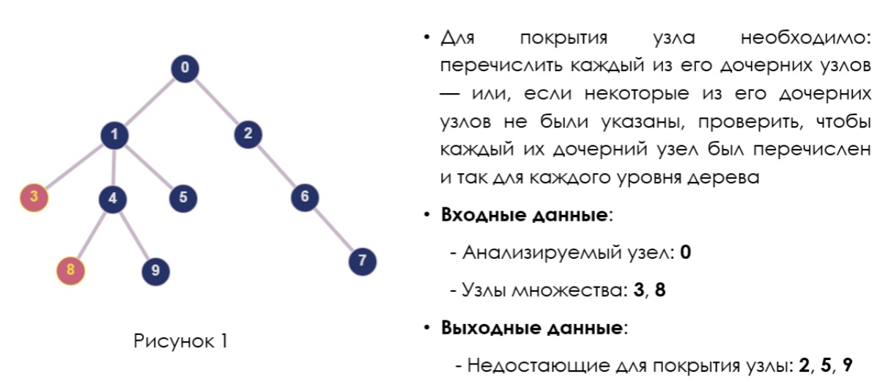

# Покрытие анализируемого узла множеством

Программа предназначена для определения, покрывает ли данный набор узлов дерева вышележащий узел. Чтобы «покрыть» узел дерева необходимо перечислить все его дочерние узлы — или, если брать уровень ниже, все дочерние узлы каждого дочернего узла, чтобы не пропустить ничего.

Программа может быть применена для определения недостающих компонентов при описании составного объекта, по множеству учтенных компонентов.

## Требования к надежности программы

Входные данные представляются в виде двух текстовых файлов с расширениями .txt и .xml. В файле с форматом .xml представлено дерево, а в файле .txt содержится первая строка с указанием id анализируемого узла, а последующие строки с id дочерних покрываемых узлов. Xml файл должен содержать единственный коревой элемент и пролог.

Каждый узел дерева, который участвует в рассмотрении должен иметь уникальный атрибут id. Все узлы от корневого до анализируемого также должны иметь уникальный атрибут id.

Выходной файл представляется в виде текстового файла с расширением .txt. Выходной файл должен содержать ответ, покрывает ли множество узлов заданный узел и списки недостающих и избыточных узлов.

Программа должна быть представлена консольным приложением с расширением .exe и при запуске принимать аргументы командной строки:

- первым аргументом записывается относительный или абсолютный путь к входному файлу формата .xml;

- вторым аргументом записывается относительный или абсолютный путь к входному файлу формата txt;

-третьим аргументом записывается относительный или абсолютный путь к выходному файлу формата txt;

Пример команды запуска программы:
```bash
app.exe C:\\Documents\\input1.xml .\input2.txt .\ output.txt
```

После записи выходных данных в файл должно происходить завершение программы.

## Требования к надежности программы
| Ситуация  | Сообщение об ошибке |
| ------------- | ------------- |
| Не передан .xml файл с деревом  | Xml file was not transferred  |
| Не передан .txt файл с указанием имен узлов  | Txt file was not transferred  |
| Ошибка при открытии .txt файл  | Failed to read .txt file  |
| Ошибка при открытии .xml файла  | Failed to read .xml file  |
| Не указан родительский узел  | The parent node is not specified in the txt file  |
| Xml содержит синтаксические ошибки  | Xml file contains syntax errors  |
| Корневой узел не имеет id  | Root node hasn’t id  |
| В дереве отсутствует указанный родительский узел  | The parent node is missing in the tree


## Требования к языкам программирования и библиотекам

Программа написана на языке C++ с использованием его стандартных библиотек и библиотеки Qt.

## Приложение
